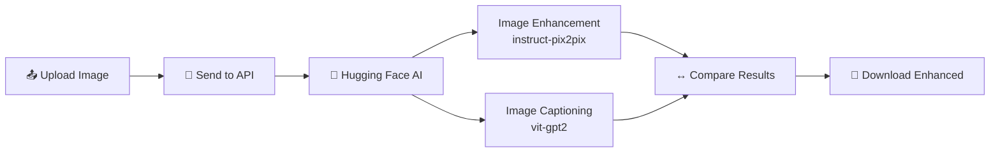

<div align="center">

# ✨ AI Image Enhancer

### Upload, Enhance & Compare — Powered by Free AI

[](https://nextjs.org)
[](https://www.typescriptlang.org)
[](https://tailwindcss.com)
[](https://huggingface.co)
[](LICENSE)

**A stunning web app that upscales, enhances, and analyzes images using free Hugging Face AI models — no paid APIs needed.**

[🚀 Live Demo](#-deployment) • [✨ Features](#-features) • [🔧 Quick Start](#-quick-start) • [📸 How It Works](#-how-it-works)

</div>

---

## ✨ Features

| Feature | Description |
|---------|------------|
| 📤 **Drag & Drop Upload** | Upload images via click or drag-and-drop with instant preview |
| 🪄 **AI Enhancement** | Upscale and enhance images to 4K quality using `instruct-pix2pix` model |
| 🔍 **AI Image Captioning** | Auto-generates intelligent descriptions of your images |
| ↔️ **Before/After Slider** | Interactive comparison slider to see the enhancement side by side |
| 💾 **Download Enhanced** | One-click download of the high-resolution enhanced image |
| 🎨 **Premium Dark UI** | Sleek zinc/indigo glassmorphism design with smooth animations |

## 🛠️ Tech Stack

| Technology | Purpose |
|-----------|---------|
| **Next.js 16** | React framework with App Router & API Routes |
| **TypeScript** | Type-safe code |
| **Tailwind CSS 4** | Utility-first styling |
| **Hugging Face Inference API** | Free AI models for enhancement & captioning |
| **react-dropzone** | Drag-and-drop file upload |
| **lucide-react** | Modern icon library |

## 📸 How It Works



1. **Upload** — Drag & drop or click to select an image (PNG, JPG, WEBP)
2. **Enhance** — Click "Enhance with AI" to process with two AI models simultaneously
3. **Compare** — Use the interactive before/after slider to see the difference
4. **Download** — Save the enhanced high-res image with one click

### AI Models Used (Free)

| Model | Task | Provider |
|-------|------|----------|
| [`timbrooks/instruct-pix2pix`](https://huggingface.co/timbrooks/instruct-pix2pix) | Image Enhancement & Upscaling | Hugging Face |
| [`nlpconnect/vit-gpt2-image-captioning`](https://huggingface.co/nlpconnect/vit-gpt2-image-captioning) | AI Image Description | Hugging Face |

Both models run on Hugging Face's **free inference API** — no credit card required.

## 🚀 Quick Start

### Prerequisites

- **Node.js** 18+ installed
- A **free Hugging Face API token** from [huggingface.co/settings/tokens](https://huggingface.co/settings/tokens)

### Installation

```bash
# 1. Clone the repo
git clone https://github.com/HaswinChony308/Image_Enhancer_ai.git
cd ai-image-enhancer

# 2. Install dependencies
npm install

# 3. Create .env.local with your free API key
echo HUGGING_FACE_TOKEN="hf_your_token_here" > .env.local

# 4. Start the dev server
npm run dev
```

Open [http://localhost:3000](http://localhost:3000) and start enhancing images! 🎉

### Environment Variables

Create a `.env.local` file in the project root:

```env
HUGGING_FACE_TOKEN="hf_your_token_here"
```

> 💡 Get your free token at [huggingface.co/settings/tokens](https://huggingface.co/settings/tokens) — no credit card needed.

## 📁 Project Structure

```
ai-image-enhancer/
├── src/
│   ├── app/
│   │   ├── api/enhance/
│   │   │   └── route.ts       ← API endpoint (HF image enhancement + captioning)
│   │   ├── globals.css        ← Global styles
│   │   ├── layout.tsx         ← Root layout with Geist fonts
│   │   └── page.tsx           ← Main page (upload, enhance, display)
│   └── components/
│       └── ComparisonSlider.tsx ← Interactive before/after slider
├── .env.local                  ← API keys (not committed)
├── package.json
├── tailwind.config.ts
└── tsconfig.json
```

## 🌐 Deployment

### Deploy on Vercel (Recommended — Free)

1. Push your code to GitHub
2. Go to [vercel.com/new](https://vercel.com/new)
3. Import your repository
4. Add environment variable: `HUGGING_FACE_TOKEN` = your token
5. Click **Deploy** — your app goes live in under a minute!

### Deploy on Other Platforms

Works on any platform that supports Next.js — Netlify, Railway, Render, etc.

## ⚠️ Free API Notes

Since this uses Hugging Face's free inference tier:

- **Cold starts**: Models may take 20-30 seconds to wake up on first use
- **Rate limits**: Free tier has usage limits; for production use, consider [Hugging Face Pro](https://huggingface.co/pricing)
- **Graceful fallbacks**: The app handles model failures gracefully — if enhancement fails, the original image is returned

## 🤝 Contributing

Contributions are welcome! Feel free to:

1. Fork the repository
2. Create a feature branch (`git checkout -b feature/amazing-feature`)
3. Commit your changes (`git commit -m 'Add amazing feature'`)
4. Push to the branch (`git push origin feature/amazing-feature`)
5. Open a Pull Request

## 📄 License

This project is licensed under the MIT License — see the [LICENSE](LICENSE) file for details.

---

<div align="center">

Made with ❤️ by [HaswinChony308](https://github.com/HaswinChony308)

**✨ Enhance your images with the power of AI — for free.**

⭐ Star this repo if you find it helpful!

</div>
